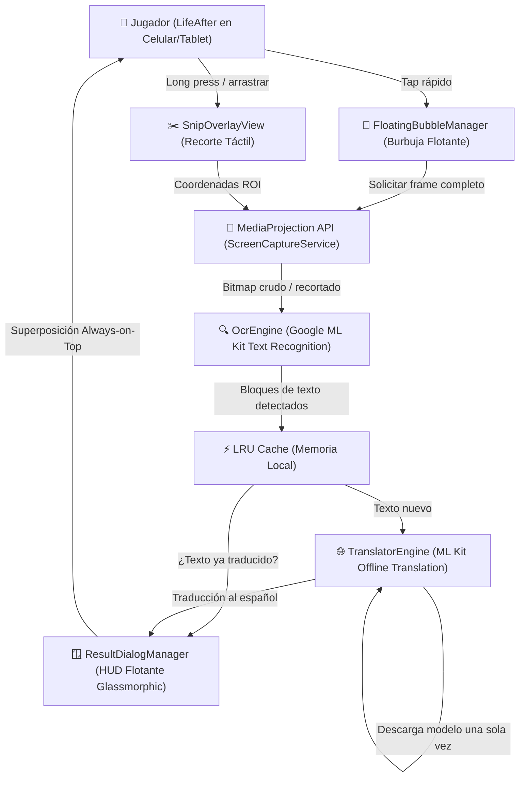

# 🏗️ Arquitectura Técnica — Traductor de Juegos (Android)

## 📌 Visión General
Aplicación Android nativa desarrollada en **Kotlin** para traducción de textos en pantalla en tiempo real u on-demand para videojuegos móviles (como *LifeAfter*). Diseñada bajo el principio de **cero intrusión en el proceso del juego** (100% seguro contra sistemas anti-trampas como NetEase ACE) y **procesamiento local con Google ML Kit** (cero consumo de datos móviles y baja latencia).

---

## 📐 Diagrama de Arquitectura de Componentes

---

## 🧩 Capas y Principios de Diseño

### 1. Capa de Presentación Flotante (`service/` & `ui/`)
- **`FloatingBubbleManager.kt`**: Implementa una ventana flotante mediante `WindowManager` (`TYPE_APPLICATION_OVERLAY`). Soporta arrastre suave por la pantalla y auto-alineación a los bordes de la pantalla (*snap to edge*).
- **`SnipOverlayView.kt`**: Vista translúcida superpuesta que captura eventos `MotionEvent` para dibujar un recuadro de selección en pantalla cuando el usuario desea traducir un menú o diálogo específico.
- **`ResultDialogManager.kt`**: Ventana flotante estilo *glassmorphic* que muestra el texto traducido sin interferir en los controles del juego, con botón de copiado rápido al portapapeles.

### 2. Capa de Captura del Sistema (`service/ScreenCaptureService.kt`)
- Implementado como un **Foreground Service** con tipo `mediaProjection` para compatibilidad estricta con Android 10 hasta Android 14+.
- Utiliza `ImageReader` en formato `RGBA_8888` para capturar el contenido gráfico del juego de forma pasiva, sin inyección de DLL ni hooks de memoria.

### 3. Capa de Inteligencia Artificial Local (`ml/`)
- **`OcrEngine.kt`**: Integra `com.google.mlkit:text-recognition` para extraer texto en milisegundos con alta precisión, aislando las coordenadas de cada bloque.
- **`TranslatorEngine.kt`**: Utiliza `com.google.mlkit:translate` para traducir de forma 100% offline una vez descargado el paquete de lenguaje (~30 MB).
- **Caché LRU**: Almacena en memoria las traducciones de diálogos y elementos recurrentes de la interfaz para reducir la latencia a 0 ms.

### 4. Capa de Configuración Dinámica (`data/` & `model/`)
- **Cero Hardcoding**: Ningún string, código de idioma o valor de opacidad está quemado en la lógica. Todo se gestiona a través de `PreferencesManager` y Enums tipados (`SupportedLanguage`, `CaptureMode`).
