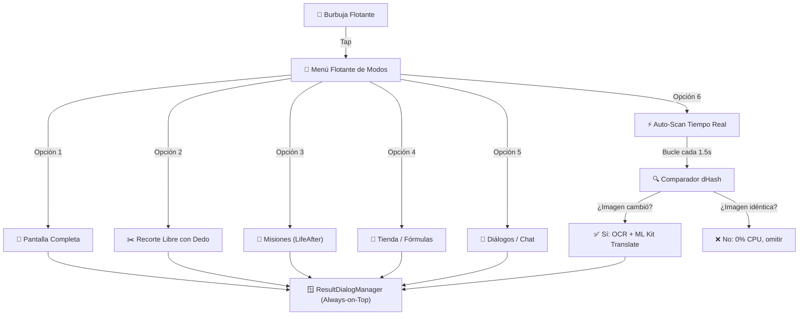

# 🏗️ Arquitectura Técnica — Traductor de Juegos (Android)

## 📌 Visión General
Aplicación Android nativa desarrollada en **Kotlin** para traducción de textos en pantalla en tiempo real u on-demand para videojuegos móviles (como *LifeAfter*). Diseñada bajo el principio de **cero intrusión en el proceso del juego** (100% seguro contra sistemas anti-trampas como NetEase ACE) y **procesamiento local con Google ML Kit** (cero consumo de datos móviles y baja latencia).

---

## 🎮 Modos de Traducción Específicos para LifeAfter

A partir del análisis de las capturas de pantalla de la tablet (resolución nativa `1340 x 800` en modo horizontal):

1. 📸 **Traducción de Pantalla Completa (`FULL_SCREEN`):**
   - Captura y analiza todo el fotograma con un solo toque en la burbuja.
2. ✂️ **Traducción Parcial / Francotirador (`PARTIAL_CROP`):**
   - Capa interactiva (`SnipOverlayView`) que permite arrastrar el dedo para recortar una descripción específica (armas, cartas de sobrevivientes o recetas).
3. 📜 **Modo Misiones (`LIFEAFTER_QUESTS`):**
   - Zona delimitada: Superior izquierda (`X: 0% a 42%`, `Y: 10% a 65%`).
   - Monitorea objetivos de misiones (Helena, Survival Manual, World Events).
4. 🏪 **Modo Tienda / Fórmulas / Crafteo (`LIFEAFTER_SHOP`):**
   - Zona delimitada: Panel central modal (`X: 5% a 95%`, `Y: 8% a 92%`).
   - Traduce catálogos de crafteo, ingredientes, descripciones y requisitos de campamento.
5. 💬 **Modo Diálogos / Notificaciones / Chat (`LIFEAFTER_CHAT`):**
   - Zona delimitada: Centro inferior (`X: 25% a 75%`, `Y: 75% a 98%`).
   - Traduce mensajes de chat global, anuncios del sistema y diálogos de NPCs.
6. ⚡ **Traducción Automática / Tiempo Real (Auto-Scan con dHash):**
   - Bucle en corrutina (`Dispatchers.Default`) que captura la zona activa cada 1.5 segundos.
   - Aplica **Difference Hash (dHash de 64 bits)** mediante [`ImageHashUtil.kt`](../app/src/main/java/com/bscl/gametranslator/util/ImageHashUtil.kt). Si el texto no cambia (`Hamming Distance <= 4`), omite el OCR y la traducción, consumiendo casi 0% de CPU y preservando la batería del dispositivo.

---

## 📐 Diagrama de Flujo de Modos

